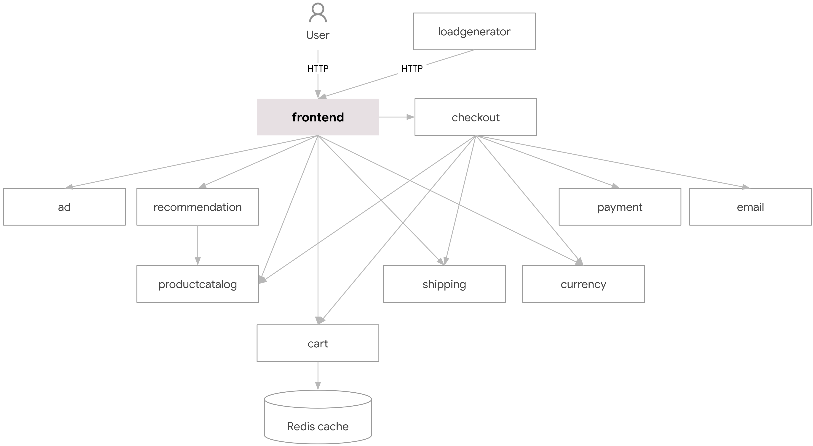
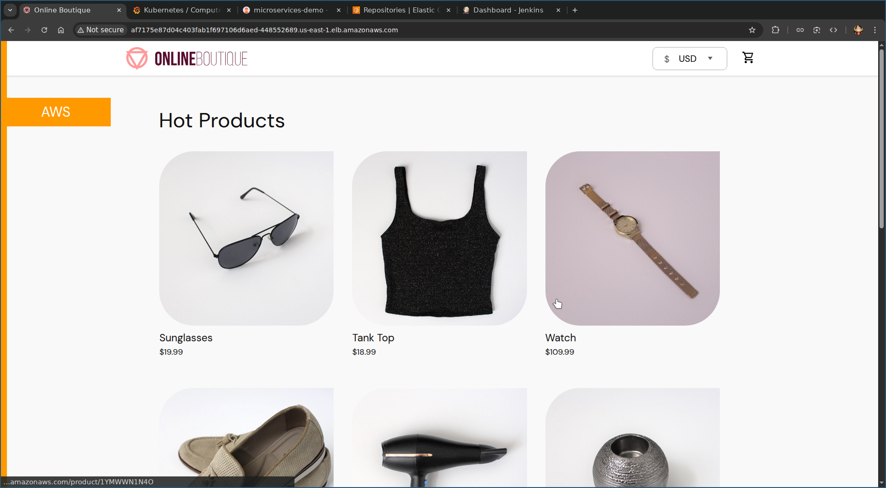
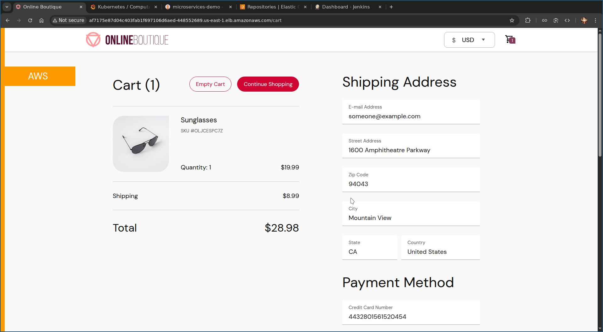
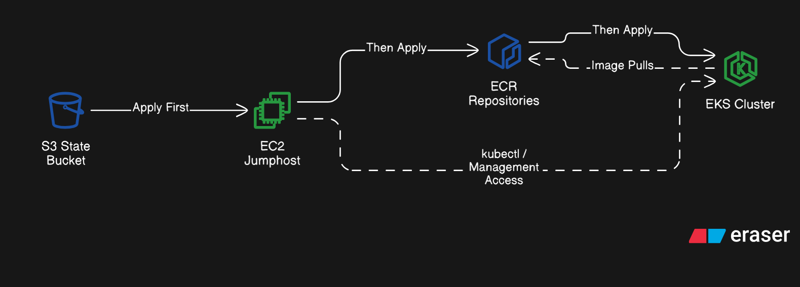
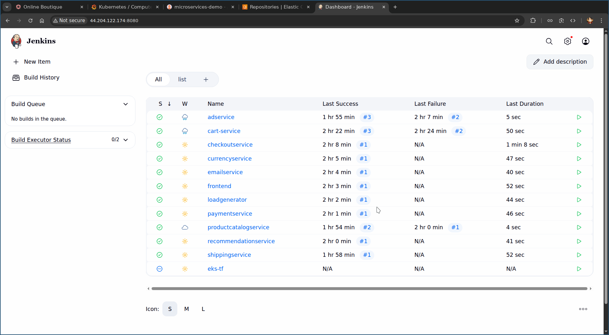
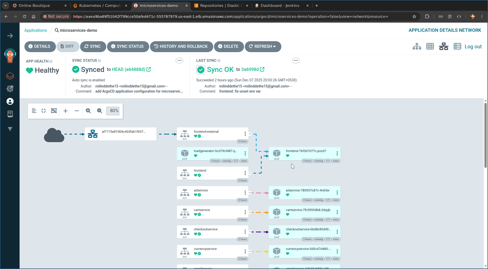
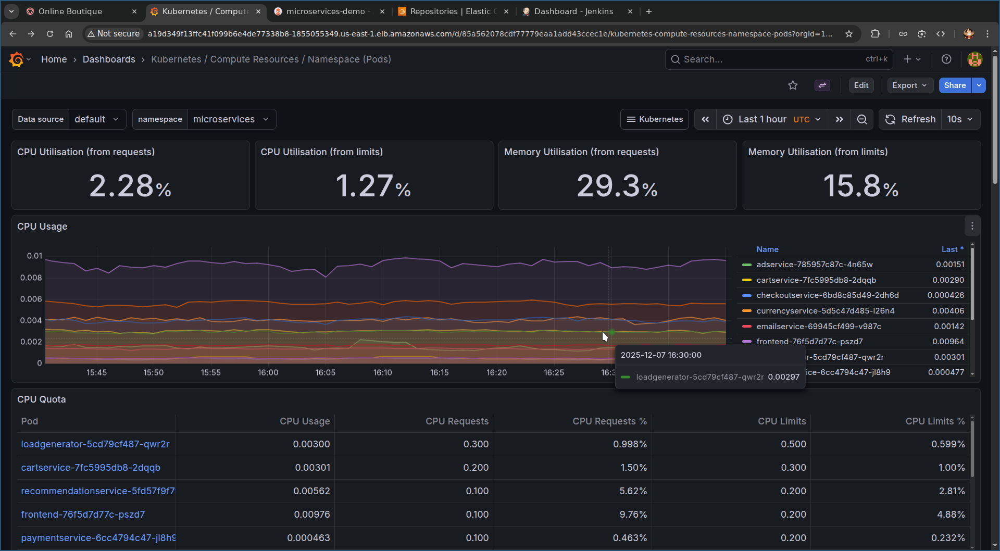

# Microservices Demo on AWS

https://github.com/user-attachments/assets/b0317c5b-c7a5-4022-8777-803a9de3fae9

This project deploys the **[Online Boutique microservices application](https://github.com/GoogleCloudPlatform/microservices-demo/)** to **AWS**. It is designed to showcase cloud-native architecture, infrastructure automation, CI/CD and platform engineering practices.

## What this project demonstrates

- **Microservices architecture** (multiple independent services)
- **AWS infrastructure** provisioned with **Terraform**
- **EKS cluster + node groups**
- **ECR for container images**
- **Kubernetes deployment** of all services
- **CI/CD pipeline** to:
  - Build Docker images
  - Push to ECR
  - Deploy to EKS automatically

## Repository map

- [`jenkinsfiles/`](./jenkinsfiles/README.md) — Pipelines that build each microservice image, push to ECR and retag Kubernetes manifests.
- [`k8s-manifest/`](./k8s-manifest/README.md) — Declarative Kubernetes specs for all services, intended to be synced by Argo CD.
- [`src/`](./src) — Application source code and Dockerfiles for every microservice (Go, Node.js, Python, .NET).
- [`terraform/`](./terraform/README.md) — Infrastructure as code. Includes:
  - [`s3-buckets/`](./terraform/s3-buckets/README.md) — Remote state storage (S3 + optional DynamoDB locks).
  - [`ec2/`](./terraform/ec2/README.md) — Jumphost/tooling EC2 box for kubectl/helm/Jenkins.
  - [`platform/ecr/`](./terraform/platform/ecr/README.md) — ECR repositories for all service images.
  - [`platform/eks/`](./terraform/platform/eks/README.md) — EKS control plane and node groups.

## How it fits together

- **Infra**: Terraform first provisions remote state buckets, then a tooling EC2, then ECR repos and the EKS cluster.
- **Build & push**: Jenkins pipelines build per-service images and push to the corresponding ECR repo; they also bump image tags in the Kubernetes manifests.
- **Deploy**: Argo CD watches `k8s-manifest/` and syncs changes to the EKS cluster. You can also `kubectl apply -f k8s-manifest/` manually if needed.
- **Observability**: Install Kube Prometheus Stack (Prometheus + Grafana) on EKS for metrics and dashboards.

## Deployment flow

1. In `terraform/s3-buckets`: create remote state storage.
2. In `terraform/ec2`: stand up the jumphost/tooling box; note SSH key and security group outputs.
3. In `terraform/platform/ecr`: create ECR repos; record repo URLs for Jenkins.
4. In `terraform/platform/eks`: create the EKS cluster and node groups; update kubeconfig.
5. Configure Jenkins with AWS creds, then run pipelines from `jenkinsfiles/` to build/push images and retag manifests.
6. Install Argo CD on the cluster; point it to `k8s-manifest/` and sync.
7. Install Kube Prometheus Stack for metrics and Grafana dashboards.

## Microservices Architecture

## AWS Architecture

WIP

## Screenshots

**Homepage Frontend**

**Checkout Page**

**Terraform Flow**

**Jenkins Pipelines**

**Argo CD Application**

**Grafana Dashboard**

## Further Improvements

* Support Multi-cloud deployments
* Use GitHub Action for CI
  * removes Jenkins servers dependency
* Use multi-branch pipeline in Jenkins
